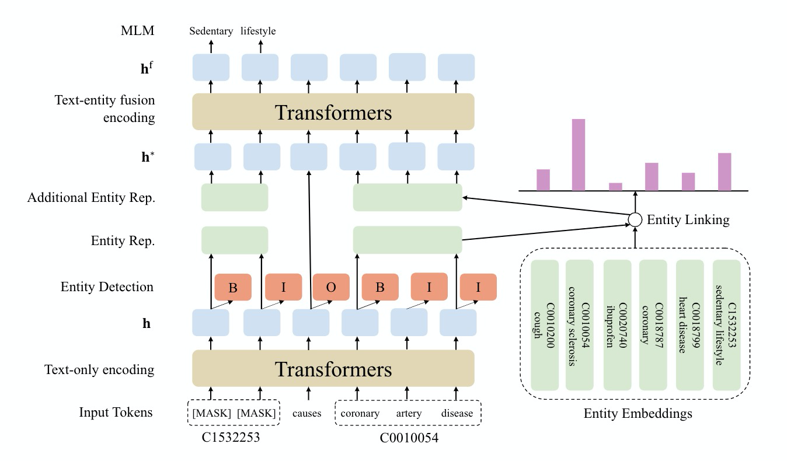

# KeBioLM
[](https://paperswithcode.com/sota/relation-extraction-on-ddi?p=improving-biomedical-pretrained-language)

[](https://paperswithcode.com/sota/relation-extraction-on-gad?p=improving-biomedical-pretrained-language)

[](https://paperswithcode.com/sota/named-entity-recognition-ner-on-jnlpba?p=improving-biomedical-pretrained-language)

[](https://paperswithcode.com/sota/named-entity-recognition-on-bc2gm?p=improving-biomedical-pretrained-language)

[](https://paperswithcode.com/sota/relation-extraction-on-chemprot?p=improving-biomedical-pretrained-language)

[](https://paperswithcode.com/sota/named-entity-recognition-on-bc5cdr-chemical?p=improving-biomedical-pretrained-language)

[](https://paperswithcode.com/sota/named-entity-recognition-on-bc5cdr-disease?p=improving-biomedical-pretrained-language)

[](https://paperswithcode.com/sota/named-entity-recognition-ner-on-ncbi-disease?p=improving-biomedical-pretrained-language)

Improving Biomedical Pretrained Language Models with Knowledge.
Accepted by BioNLP 2021.
[Paper](https://arxiv.org/abs/2104.10344)

# Introduction

KeBioLM: **K**nowledge **e**nhanced **Bio**medical pretrained
**L**anguage **M**odel

KeBioLM applies text-only encoding layer
to learn entity representation and applies a
text-entity fusion encoding to aggregate entity
representation.
KeBioLM has three pretraining tasks: 
- Masked Language Model: Extend whole word masking to whole entity masking.
- Entity Detection: Predict B/I/O tags for NER.
- Entity Linking: Link predicted entities to UMLS.

# Pre-trained Model
You can download our model from [Google Drive](https://drive.google.com/file/d/1kMbTsc9rPpBc-6ezEHjMbQLljW3SUWG9).
Our model contain pre-trained weights `pytorch_model.bin`, a tokenizer `vocab.txt` (same as PubMedBERT) and an entity dictionary for entity linking task in pretraining phase `entity.jsonl`.

# Environment
All codes are tested under Python 3.7, PyTorch 1.7.0 and Transformers 3.4.0.

# Fine-tune KeBioLM for NER and RE

## BLURB Dataset
Download BLURB dataset from [here](https://microsoft.github.io/BLURB/sample_code/data_generation.tar.gz).

## NER
For example, to fine tune BC5CDR-disease dataset:
```sh
cd ner
CUDA_VISIBLE_DEVICES=0 python \
run_ner.py \
--data_dir $BC5CDR_DATASET \
--model_name_or_path $KEBIOLM_CHECKPOINT_PATH \
--output_dir $OUTPUT_DIR \
--num_train_epochs 60 \
--do_train --do_eval --do_predict --overwrite_output_dir \
--gradient_accumulation_steps 2 \
--learning_rate 3e-5 \
--warmup_steps 1710 \
--evaluation_strategy epoch \
--max_seq_length 512 \
--per_device_train_batch_size 8 \
--eval_accumulation_steps 1 \
--load_best_model_at_end --metric_for_best_model f1
```

To use your own task for fine-tuning, please prepare `train.tsv`, `test.tsv` and `dev.tsv` in same folder.
If your task contain tags more than *B,I,O* like *B-disease, I-disease*, please also provide a label file which contains each label in a line:
```
O
B-disease
I-disease
B-symptom
I-symptom
```
And you should pass this label file by `--labels $label_file`.

## RE
To fine-tune DDI dataset:
```sh
cd re
CUDA_VISIBLE_DEVICES=0 python \
run.py \
--task_name ddi \
--data_dir $DDI_DATASET \
--model_name_or_path $KEBIOLM_CHECKPOINT_PATH \
--output_dir $OUTPUT_DIR \
--num_train_epochs 60 \
--do_train --do_eval --do_predict --overwrite_output_dir \
--gradient_accumulation_steps 1 \ 
--learning_rate 1e-5 \
--warmup_steps 9486 \
--evaluation_strategy epoch \
--max_seq_length 256 \
--per_device_train_batch_size 16 \
--eval_accumulation_steps 1 \ 
--load_best_model_at_end --metric_for_best_model f1
```
Since DDI, ChemProt and GAD dataset have different formats and labels, we should specific `--task_name ddi/chemprot/gad`.

## Hyperparameters for BLURB dataset
To reproduce the results of our paper, please try training models with following hyperparameters.
All models are trained for 60 epochs with a 10% steps linear warmup.

| Dataset  | Learning rate | Sequence Length | Batch size | Gradient accumulation |
| :------: | :-----------: | :-------------: | :--------: | :-------------------: |
| BC5chem  |     3e-5      |       512       |     8      |           2           |
|  BC5dis  |     1e-5      |       512       |     8      |           2           |
|   NCBI   |     1e-5      |       512       |     8      |           2           |
|  BC2GM   |     3e-5      |       512       |     8      |           2           |
|  JNLPBA  |     1e-5      |       512       |     8      |           2           |
| ChemProt |     1e-5      |       256       |     16     |           1           |
|   DDI    |     1e-5      |       256       |     16     |           1           |
|   GAD    |     1e-5      |       128       |     16     |           1           |

BC2GM, GAD and DDI datasets have relatively higher variance, you can try different seeds by setting `--seed $seed_number`.

# UMLS Knowledge Probing
For a relation triplet `(s, r, o)` in UMLS, we generate two queries: `[CLS] [MASK] r o [SEP]` and `[CLS] s r [MASK] [SEP]`.
We request language models to restore the masked entites.
We collect 143771 queries for 922 relation types.

## Rebuild the dataset
To rebuild our dataset for UMLS knowledge probing, you should prepare [UMLS2020AA](https://www.nlm.nih.gov/research/umls/licensedcontent/umlsarchives04.html#2020AA) version.
After installing UMLS2020AA, you should have a folder `$UMLS_DIR` with `MRCONSO.RRF`, `MRREL.RRF`, `MRSTY.RRF`.
Using `probe/build.py` to rebuild the probing dataset `dataset.txt` based on UMLS LUI and relation.
```sh
cd probe
python build.py $UMLS_DIR
```
Rebuilding process will take about 10 minutes.

## Probing
The default setting of probing is `max_length_of_[MASK] = 10`, `beam_width = 5`.
To probe `dataset.txt` for SciBERT (or other Bert-based language models):
```sh
cd probe
python beam_batch_decode.py $SCIBERT_PATH dataset.txt
```
To probe `dataset.txt` for KeBioLM:
```sh
cd probe
python beam_batch_decode.py $KEBIOLM_CHECKPOINT_PATH dataset.txt
```
Probing with `beam_width = 5` will take very long time (over 1 day on V100), you may split `dataset.txt` for using multi GPUs to decode.

To perform evaluation on probing results, using:
```sh
cd probe
python metric.py $predict_file dataset.txt $UMLS_DIR
```

## Citation
```bibtex
@inproceedings{yuan-etal-2021-improving,
    title = "Improving Biomedical Pretrained Language Models with Knowledge",
    author = "Yuan, Zheng  and
      Liu, Yijia  and
      Tan, Chuanqi  and
      Huang, Songfang  and
      Huang, Fei",
    booktitle = "Proceedings of the 20th Workshop on Biomedical Language Processing",
    month = jun,
    year = "2021",
    address = "Online",
    publisher = "Association for Computational Linguistics",
    url = "https://aclanthology.org/2021.bionlp-1.20",
    doi = "10.18653/v1/2021.bionlp-1.20",
    pages = "180--190",
    abstract = "Pretrained language models have shown success in many natural language processing tasks. Many works explore to incorporate the knowledge into the language models. In the biomedical domain, experts have taken decades of effort on building large-scale knowledge bases. For example, UMLS contains millions of entities with their synonyms and defines hundreds of relations among entities. Leveraging this knowledge can benefit a variety of downstream tasks such as named entity recognition and relation extraction. To this end, we propose KeBioLM, a biomedical pretrained language model that explicitly leverages knowledge from the UMLS knowledge bases. Specifically, we extract entities from PubMed abstracts and link them to UMLS. We then train a knowledge-aware language model that firstly applies a text-only encoding layer to learn entity representation and then applies a text-entity fusion encoding to aggregate entity representation. In addition, we add two training objectives as entity detection and entity linking. Experiments on the named entity recognition and relation extraction tasks from the BLURB benchmark demonstrate the effectiveness of our approach. Further analysis on a collected probing dataset shows that our model has better ability to model medical knowledge.",
}
```
